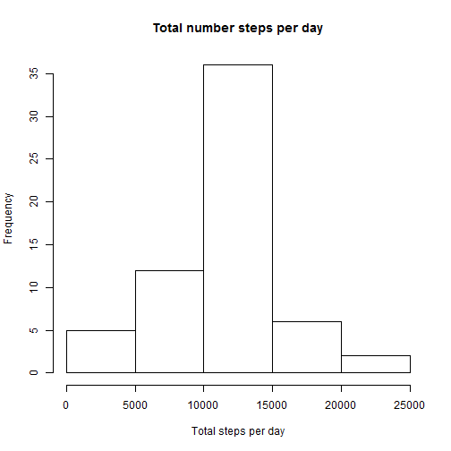

### Loading and preprocessing the data

Load the data:


```r
dfActivity <- read.csv("activity.csv", sep = ",", header = TRUE, na.strings = "NA", 
        colClasses=c("numeric", "character","numeric"))
```

Basic data exploration:

```r
head(dfActivity)
```

```
##   steps       date interval
## 1    NA 2012-10-01        0
## 2    NA 2012-10-01        5
## 3    NA 2012-10-01       10
## 4    NA 2012-10-01       15
## 5    NA 2012-10-01       20
## 6    NA 2012-10-01       25
```

```r
names(dfActivity)
```

```
## [1] "steps"    "date"     "interval"
```

Convert character date into a date type:

```r
dfActivity$date <- as.Date(dfActivity$date, "%Y-%m-%d")
```
### What is mean total number of steps taken per day?
We calculate the total number of steps taken per day:

```r
dfStepsByDay <- aggregate(steps ~ date, data = dfActivity, FUN=sum, na.rm = TRUE)
```

The historgramm is 

```r
hist(dfStepsByDay$steps, main = "Total number of steps taken each day", xlab="Total steps per day")
```

 

Further we report the mean and median:

```r
mean(dfStepsByDay$steps)
```

```
## [1] 10766.19
```

```r
median(dfStepsByDay$steps)
```

```
## [1] 10765
```

### What is the average daily activity pattern?
Build the time series

```r
timeSeries <- tapply(dfActivity$steps, dfActivity$interval, mean, na.rm = TRUE)
```
and plot it:

```r
plot(row.names(timeSeries), timeSeries, type = "l", xlab = "5-min interval", 
     ylab = "Average across all Days", main = "Average number of steps")
```

 

The time interval with the maximum number of steps is:

```r
names(which.max(timeSeries))
```

```
## [1] "835"
```

### Imputing missing values
We calculate the number of missing values in the data set as:

```r
sapply(dfActivity, function(x) {sum(is.na(x))})
```

```
##    steps     date interval 
##     2304        0        0
```

To impute the missing value of an interval we use the mean over all days for that interval:

```r
dfStepsByInterval <- aggregate(steps ~ interval, data = dfActivity, FUN=mean, na.rm = TRUE)
```
and create a new data set dfActivityNoNa with the missing data filled in:

```r
dfActivityNoNa <- dfActivity

for (i in 1:nrow(dfActivity)) {
  x <- dfActivity[i, ]
  if (is.na(x$steps)) {
    steps <- subset(dfStepsByInterval, interval == x$interval)$steps
  } else {
    steps <- x$steps
  }
  dfActivityNoNa[i,]$steps <- steps  
}
```

The histogram:

```r
dfStepsByDate <- aggregate(steps ~ date, data = dfActivityNoNa, FUN=sum, na.rm = TRUE)

hist(dfStepsByDate$steps, main = "Total number steps per day", xlab="Total steps per day")
```

 

The mean is the same as in the first part, but the median slightly differs:

```r
mean(dfStepsByDate$steps)
```

```
## [1] 10766.19
```

```r
median(dfStepsByDate$steps)
```

```
## [1] 10766.19
```

### Are there differences in activity patterns between weekdays and weekends?
Define a function to calculate the day type (weekday or weekend) and add a new row 'dateType' to the data set applying the defined function:

```r
fToDayType <- function(x) { 
  if (x == 'Saterday' || x == 'Sunday') 'weekend' else 'weekday'
}
dfActivityNoNa$dayType <- apply(dfActivityNoNa,1,function(row) {fToDayType(weekdays(as.Date(row[2],'%Y-%m-%d')))})
dfActivityNoNa$dayType <- as.factor(dfActivityNoNa$dayType)
```

Aggregate the data and show the panel plot:

```r
dfStepsByIntervalAndDayType <- aggregate(steps ~ interval + dayType, data = dfActivityNoNa, mean)
library(lattice)
xyplot(steps ~ interval | dayType, dfStepsByIntervalAndDayType, type = "l", layout = c(1, 2), 
       xlab = "5-min interval", ylab = "Number of steps")
```

 

